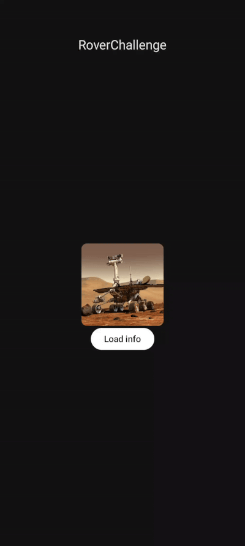

# RoverChallenge

## 🚀 Introduction

RoverChallenge is an Android application that simulates the movement of a rover based on a set of predefined instructions. The project follows **MVVM and Clean Architecture** principles, ensuring modularity, scalability, and maintainability.

## 📌 Features

- Load rover movement data from a JSON file.
- Display rover position updates dynamically.
- Jetpack Compose UI with animations.
- 2 screens for Portrait and Landscape
- Unit tests for core logic.
- Follows best practices: **SOLID, Clean Architecture, Dependency Injection (Hilt), and Coroutines**.

## 🛠️ Tech specs

- **Language:** Kotlin
- **UI:** Jetpack Compose
- **Architecture:** MVVM + Clean Architecture
- **Dependency Injection:** Hilt
- **Data Storage:** JSON (Assets)
- **Testing:** JUnit, Mockito
- **CI/CD:** GitHub Actions

##  🏗️ Decisions and Considerations

From the start, I wanted to follow good practices. 
If you check the commits, you'll see how I made decisions throughout the development by setting up the architecture structure, creating the data classes, and making sure the code was functional before anything else.

Later, I focused on writing tests and refactoring the code to improve quality and maintainability.
For the UI, my goal was to keep the screens clean and easy to understand, without unnecessary elements. I experimented with other layouts but ended up discarding them.
I decided to go with two screens because I didn’t want to design only for mobile phones. It’s important to consider larger devices like tablets.

I also considered integrating Retrofit, but it wasn’t essential for this challenge. However, the structure is already in place, so it can be easily added if needed in the future.

I focused on applying Clean Architecture, modularization, and best development practices, ensuring that the code is easy to maintain and scale in my opinion, the app has a solid foundation to keep evolving.


## 📂 Project Structure

```
RoverChallenge
│── app
│   ├── data
│   │   ├── model
│   │   ├── repository
│   ├── domain
│   │   ├── mapper
│   │   ├── model
│   │   ├── repository
│   │   ├── usecase
│   ├── presentation
│   │   ├── ui
│   │   ├── viewmodel
│   ├── di
│   ├── utils
```


### Prerequisites

- Android Studio **Koala** | 2024.1.1 Patch 1 or later (this is my version)

### Installation

1. **Clone the repository**

```sh
git clone https://github.com/RVenturaSuarez/RoverChallenge.git
```

2. **Open in Android Studio**

   - Open Android Studio
   - Click on `Get from VCS`
   - Paste url git `https://github.com/RVenturaSuarez/RoverChallenge.git`
   - Select folder to save project
   - Click in clone button

3. **Run the project**

   - Sync Gradle files
   - Click `Run` ▶️ in Android Studio

## ✅ Running Tests

To run unit tests, execute:

```sh
./gradlew testDebugUnitTest
```

## 🔧 CI with GitHub Actions

This project includes a GitHub Actions workflow for automated testing. It runs tests on every **push** or **pull request** to `master`, `develop`, or `feature/rover-logic` branches.


## 📸 Screenshots





